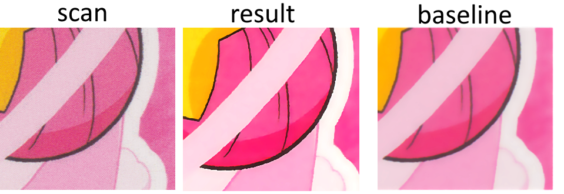

# Anime Halftone Inversing

Experimental neural network-based descreening filter for scanned Anime pictures

## Aiming

Scans often contain visible halftone dot patterns introduced by the printing process (e.g. offset printing).
A common approach is to use traditional filters such as Gaussian blur, but those methods tend to soften edges and wash out fine details, resulting in an overly blurry image.
This project explores a CNN (Convolutional Neural Network) that learns to remove halftone dots while preserving line art and texture, converting dotted scans into clean, smooth images.

Below is a preliminary result, compared against a simple Gaussian-blur baseline.



## Architecture

The network can process images of any size during inference phase since it is a fully
convolutional network.

## Inference

```sh
python3 -m descreen INPUT.png
```
